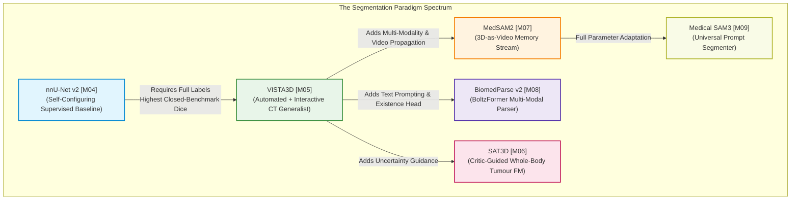

# Module 01: 3D Segmentation, Spatial Parsing & Promptable Foundation Models

> Evidence-audited cartography of foundational segmentation architectures, interactive spatial parsers, and task-specific reference baselines supporting the [Medical Imaging AI Ground Layer](../../dossier_medical_imaging_AI_ground_layer_v4.1.0.md).

---

## 1. Executive Summary & The Core Landscape Tension

In medical image computing, segmentation has evolved from isolated, single-task U-Nets into two competing technological paradigms:
1. **The Self-Configuring Task-Specific Baseline Standard ([nnU-Net v2](./nnunet_v2.md))**: Fully supervised models that automatically configure network topology, patch sizes, and augmentations to match dataset physics. On fixed, closed benchmarks, this standard remains the gold-standard accuracy baseline.
2. **The Promptable & Multi-Modal Foundation Model Frontier**: Generalist models ([VISTA3D](./vista3d.md), [MedSAM2](./medsam2.md), [BiomedParse v2](./biomedparse_v2.md), [SAT3D](./sat3d.md), [Medical SAM3](./medical_sam3.md)) that provide interactive zero-shot delineation, 3D memory propagation, natural language prompt parsing, and uncertainty feedback.

### The 23x Data-Efficiency Paradox
> [!IMPORTANT]
> **Pretraining Scale vs. In-Domain Inductive Bias**: Across structured volumetric challenges (AMOS22, KiTS23), **nnU-Net v2 trained from scratch on only 500 cases achieves higher Dice than massive vision foundation models (VISTA3D) pretrained on 11,454 cases (89.68% vs 88.10% DSC on AMOS)**. Pretraining scale on uncurated multi-center data does not automatically compensate for task-specific spatial inductive biases and exact voxel-spacing adaptation.

### The Fundamental Field-State Trade-Off
As formalized in Section 4.2 of the Ground Layer Dossier:
> **The scientifically meaningful comparison is NOT "Foundation Model vs. U-Net."**  
> The core clinical question is:  
> *How much accuracy, calibration, annotation effort, robustness, and adaptation cost are exchanged when moving from a task-specific supervised system to a promptable generalist system?*

---

## 2. Master Module 01 Model Registry & Comparative Matrix

| Canonical ID | Model System | System Class | Scope | Primary Modalities | Pretraining Scale | Evidence Code | Availability Tier | Workstation VRAM | Model Card |
|:---:|---|:---:|:---:|---|---|:---:|:---:|:---:|:---:|
| **[M04]** | **nnU-Net v2** | `companion` | `workflow_specialist` | 3D/2D CT, MRI, PET, Microscopy | Task-specific training (Scratch) | `[E1]` | **Tier A** (Open) | 8–24 GB | [Card](./nnunet_v2.md) |
| **[M05]** | **VISTA3D / NV-Segment** | `core_fm` | `modality_generalist` | 3D CT (NV-Segment adds MRI) | 11,454 CT volumes (132 classes) | `[E1]` / `[E2]` | **Tier A** (Open) | 14–18 GB | [Card](./vista3d.md) |
| **[M06]** | **SAT3D** | `core_fm` | `workflow_specialist` | 3D CT & MRI (Pan-cancer) | 17,075 3D volume-mask pairs | `[E1]` | **Tier A** (Open) | 12–16 GB | [Card](./sat3d.md) |
| **[M07]** | **MedSAM2** | `core_fm` | `modality_generalist` | 3D CT/MRI/PET & 2D Video | >455k 3D scans + 76k video frames | `[E3]` / `[E2]` | **Tier A** (Open) | 8–12 GB | [Card](./medsam2.md) |
| **[M08]** | **BiomedParse v2** | `core_fm` | `generalist` | 9 Modalities (CT, MRI, WSI, US) | Million-scale image-mask triplets | `[E2]` (v1 `[E1]`)| **Tier A** (Open) | 6–10 GB | [Card](./biomedparse_v2.md) |
| **[M09]** | **Medical SAM3** | `core_fm` | `generalist` | 10 Modalities (2D & 3D) | 33 Datasets (>2M mask instances) | `[E3]` | **Tier A** (Open) | 12–16 GB | [Card](./medical_sam3.md) |

---

## 3. Interactive Prompt Paradigms & Mechanism Comparison

The promptable models in this module employ fundamentally distinct prompting mechanisms to condition feature decoding:

| Model | Prompt Interface | Interaction Protocol & Metric Standard | 3D Volumetric Handling | Unique Operational Advantage |
|---|---|---|---|---|
| **nnU-Net v2** | None (Deterministic) | Fully supervised task-specific training | Full native 3D sliding window | Maximum boundary fidelity; zero prompt ambiguity |
| **VISTA3D** | Spatial Clicks (Pos/Neg) + Class Indices | $\text{NoC@85} = 2.4$ (automated error-center oracle clicks) | Native 3D convolutional transformer | Unifies automated 132-class parsing with fast click refinement |
| **SAT3D** | Clicks, Boxes & Critic Maps | $\text{NoC@85} = 2.1\text{--}3.2$ (oracle clicks + critic uncertainty maps) | 3D shifted-window transformer | Guided by predictive uncertainty; excels on infiltrative tumours |
| **MedSAM2** | Keyframe Bounding Boxes / Points | Single 2D bounding box on keyframe $\rightarrow$ 3D video propagation | 3D-as-video slice propagation | >85% reduction in user annotation effort across 100+ slices |
| **BiomedParse v2**| Natural Language Queries | Text queries conforming to RadLex/SNOMED + existence gating | 2.5D multi-slice context | Built-in existence classifier prevents false-positive hallucinations |
| **Medical SAM3** | Mixed (Text + Bounding Boxes) | $\text{NoC@85} = 2.5$ on points; open-vocabulary text queries | 2D/3D contextual chunking | Bridges the medical domain gap without requiring manual boxes |

---

## 4. Ground-Layer Audit: Contamination & Ontology Doctrines

### 1. Pretraining Contamination Audit
When evaluating models in this module against benchmarks in [`docs/01_datasets/01_segmentation_3d/`](../../01_datasets/01_segmentation_3d/README.md), observe the **Contamination Doctrine**:
- **In-Distribution Overlap**: VISTA3D, MedSAM2, SAT3D, and Medical SAM3 were pretrained on large aggregations of public biomedical datasets. Their evaluations on **TotalSegmentator, AMOS22, KiTS23, and MSD** are strictly **in-distribution evaluations**. Superiority over baselines on these datasets reflects dataset familiarity rather than zero-shot generalization.
- **True External Validation**: Generalization must be audited against external, multi-center cohorts withheld from pretraining (e.g., [RAD-ChestCT](../../01_datasets/02_radiology_ct_mri/rad_chestct.md), private hospital PACS, or blinded competitive challenge test sets).

### 2. The Label Ontology Harmonization Doctrine
Zero-shot evaluations across multi-organ benchmarks require explicit class-mapping dictionaries. Discrepancies between ontologies (e.g., 132 VISTA classes vs 117 TotalSegmentator classes vs 15 AMOS classes) can artificially crater benchmark scores if vascular or organ subdivisions are not translated correctly.

---

## 5. Workstation Operational Deployment Guidelines

To prevent `CUDA OutOfMemoryError` and ensure reproducible inference on consumer hardware (RTX 3090/4090 24GB):

1. **Sliding-Window Batch Size**: Always set `sw_batch_size = 1`. Setting batch size $>1$ on $96^3$ or $128^3$ volumetric patches causes exponential memory spikes.
2. **Memory Bank Horizon**: In 3D video propagation models (MedSAM2), clamp `max_memory_history = 16` to prevent memory accumulation on scans $>300$ slices.
3. **Precision**: Use Automatic Mixed Precision (`torch.bfloat16` or `torch.float16`) to halve feature activation memory.
4. **All verification snippets** provide authentic production imports and CLI invocation references annotated with `# Requirements: pip install ...`.
