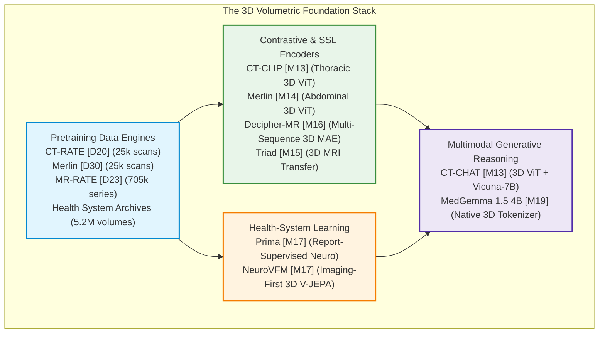

# Module 02: Volumetric CT & MRI Radiology Foundation Models

> Evidence-audited cartography of 3D computed tomography (CT) and magnetic resonance imaging (MRI) foundation models, cross-sequence representation engines, and conversational volumetric diagnosticians supporting the [Medical Imaging AI Ground Layer](../../dossier_medical_imaging_AI_ground_layer_v4.1.0.md).

---

## 1. Executive Summary & The Volumetric AI Frontier

Volumetric radiology (3D CT and MRI) represents the primary diagnostic workload in hospital emergency, oncology, and surgical workflows. However, early medical AI models relied almost exclusively on 2D projections (e.g., chest radiographs) or isolated 2D slice-by-slice processing, completely discarding through-plane anatomical continuity and 3D spatial context.

As formalized in Section 4.3 of the Master Dossier, the 2026 3D radiology frontier is **plural**, moving across a clear technical lineage:

```text
3D clinical dataset + report pairing
        -> contrastive volumetric representation
        -> reusable / adaptable 3D encoder
        -> generative volumetric reasoning
        -> grounded physical-space localization
        -> longitudinal change modelling
        -> tool-verified quantitative reasoning
```



### The Core Landscape Tension: Domain Specialists vs. Multimodal Generalists
- **Native 3D Domain Specialists ([CT-CLIP](./ct_clip_chat.md), [Merlin](./merlin.md), [NeuroVFM](./neurovfm.md))**: Optimized explicitly for volumetric voxel grids and disease classification. They preserve spatial fidelity and achieve high diagnostic sensitivity (AUROC 0.88–0.95; CT-RATE Macro-F1 0.762).
- **Multimodal Generalists ([MedGemma 1.5](./medgemma_1_5.md))**: Ingest volumetric data through aggressive spatial pooling (capping visual tokens to 512–1024) to fit LLM context windows. While offering conversational interaction and cross-modal reasoning, they encounter a significant performance ceiling on fine-grained diagnostic classification (CT-RATE Macro-F1 0.270).

---

## 2. Master Module 02 Model Registry & Comparative Matrix

| Canonical ID | Model System | System Class | Scope | Modality & Target Anatomy | Pretraining Scale & Counting Units | Evidence Code | Availability Tier | Workstation VRAM | Model Card |
|:---:|---|:---:|:---:|---|---|:---:|:---:|:---:|:---:|
| **[M13]** | **CT-CLIP & CT-CHAT** | `core_fm` | `modality_generalist` | 3D Non-Contrast Chest CT (Thorax, Lungs) | 25,692 studies / 50,188 reconstructed volumes (CT-RATE) | `[E1]` / `[E2]` | **Tier A/B** (Open) | 14–24 GB | [Card](./ct_clip_chat.md) |
| **[M14]** | **Merlin** | `core_fm` | `organ_specialist` | 3D Abdominal & Pelvic CT (752 Tasks) | 15,331 CT scans (>6M slices) + 1.8M ICD codes (Stanford) | `[E1]` | **Tier B** (Gated DUA) | 14–16 GB | [Card](./merlin.md) |
| **[M15]** | **Triad** *(Comparator)* | `core_fm` | `modality_generalist` | 3D Multi-Anatomy MRI (Brain, Spine, Knee) | ~129,000 3D MRI volumes (MedIA 2026) | `[E1]` / `[E2]` | **Tier A** (Open) | 12–16 GB | Reference `[S40]` |
| **[M16]** | **Decipher-MR** | `core_fm` | `modality_generalist` | 3D Multi-Sequence MRI (Brain & Body) | >200,000 MRI series / >22,000 studies (GE HealthCare) | `[E1]` | **Tier B** (Research) | 12–14 GB | [Card](./decipher_mr.md) |
| **[M17]** | **Prima** | `core_fm` | `organ_specialist` | 3D Multi-Sequence Brain MRI (52 Diagnoses) | >220,000 clinical MRI studies (Michigan Health System) | `[E1]` | **Tier A** (MIT Open) | 10–12 GB | [Card](./prima.md) |
| **[M17]** | **NeuroVFM** | `core_fm` | `organ_specialist` | 3D Brain CT & MRI (156 Diagnoses) | 5.24M routine clinical volumes / 566,915 studies (V-JEPA) | `[E1]` | **Tier B** (Research) | 14–24 GB | [Card](./neurovfm.md) |
| **[M19]** | **MedGemma 1.5 4B** | `core_fm` | `generalist` | 3D CT/MRI, 2D CXR, WSI, EHR Text | Multimodal mixture (CT-RATE, MIMIC, CheXpert, WSI) | `[E2]` | **Tier B** (HAI-DEF) | 8–16 GB | [Card](./medgemma_1_5.md) |

---

## 3. 3D Tokenization Strategies vs. Slice Pooling

The mechanisms used to convert high-dimensional volumetric voxel scans into neural representations dictate model memory consumption, spatial fidelity, and clinical utility:

| Strategy | Architecture Archetype | 3D Spatial Representation | Pros | Cons | Representative Models |
|---|---|---|---|---|---|
| **Native 3D Patch Convolution** | 3D Vision Transformer (ViT) | 3D convolutional kernel (e.g. $16 \times 16 \times 16$) projects sub-volumes directly into tokens with 3D positional embeddings | Preserves complete z-axis anatomical continuity and volumetric organ boundaries | High activation memory; requires downsampled or windowed inputs ($O(D \cdot H \cdot W)$) | **CT-CLIP `[M13]`**, **Merlin `[M14]`** |
| **Volumetric Joint-Embedding Predictive Architecture (V-JEPA)** | 3D Non-Generative Self-Supervised ViT | Predicts representations of masked 3D spatiotemporal volume blocks in latent feature space | Learns physical tissue geometry without pixel reconstruction; maps CT & MRI into a unified coordinate space | Requires separate instruction-tuning adapter for narrative report generation | **NeuroVFM `[M17]`** |
| **Multi-Sequence 3D MAE + Conditioning** | Sequence-Conditioned 3D ViT | 3D masked autoencoding with sequence-type tokens (T1, T2, FLAIR, DWI) | Overcomes MRI intensity non-standardization while retaining sequence-specific contrast | Pretraining requires heterogeneous multi-sequence datasets | **Decipher-MR `[M16]`** |
| **Autoregressive 3D Token Subsampling** | Multimodal LLM Projector | 3D convolutional patch projector with aggressive spatial pooling (capped to 512–1024 tokens) | Seamless integration into conversational LLMs; multi-turn chat and cross-modal reasoning | Discards sub-millimeter micro-nodules and fine vascular details due to token budgeting | **MedGemma 1.5 `[M19]`** |
| **2D Slice Pooling (Legacy Baseline)** | 2D CNN / ViT + Mean/Max Pooling | Computes 2D feature maps per axial slice independently, then aggregates across z-axis | Low memory footprint; compatible with standard 2D pre-trained weights | Discards through-plane spatial trajectories; lags 3D models by +12% to +27% AUROC | Standard ResNet-50 / BiomedCLIP baselines |

---

## 4. Hardware Scaling & Operational Deployment Profiles

### The Volumetric Memory Cliff
Volumetric 3D neural networks operate under severe memory constraints compared to 2D networks:
$$\text{Memory}_{3D} \propto B \times C \times D \times H \times W$$
A single $512 \times 512 \times 300$ abdominal CT volume contains **78.6 million voxels**. Attempting unwindowed forward passes on uncompressed volumes causes immediate CUDA Out-of-Memory (OOM) failures even on 80GB A100/H100 GPUs.

### Operational Deployment Rules
To ensure reproducible execution on consumer workstation hardware (**NVIDIA RTX 3090 / 4090 24GB**):
1. **Sliding-Window Batch Size Contract**: Always enforce `sw_batch_size = 1`. Setting batch size $>1$ on $64 \times 128 \times 128$ patches triggers exponential memory saturation.
2. **Precision**: Enforce `torch.bfloat16` or `torch.float16` across all forward passes, cutting active activation memory by 50% with $<0.1\%$ change in AUROC.
3. **Spatial Resampling**: Standardize input volumes to isotropic resolutions ($1.0\text{ mm}$ or $2.0\text{ mm}$) or fixed patch dimensions prior to patch embedding.
4. **Quantization for Generative Backbones**: For conversational models with LLM decoders (CT-CHAT 7B, MedGemma 1.5 4B), deploy 4-bit / 8-bit `bitsandbytes` quantization to run inference comfortably in 12–16 GB VRAM.

| Hardware Configuration | Workstation Feasibility | Supported Models & Regimens | Critical Operational Constraint |
|---|:---:|---|---|
| **Single RTX 3080 / 4080 (10–16 GB)** | ✅ Partial | Prima (10GB), Decipher-MR (12GB), MedGemma 1.5 Quantized (8GB) | Cannot run full FP16 CT-CHAT or unwindowed 3D ViT |
| **Single RTX 3090 / 4090 (24 GB)** | ✅ Complete | **All models**: CT-CLIP, Merlin, Decipher-MR, Prima, NeuroVFM, MedGemma 1.5 | Must strictly maintain `sw_batch_size = 1` |
| **Dual GPU (2x 24 GB) / A5000 / A6000** | ✅ Production | High-throughput batch inference, sliding-window TTA, LoRA fine-tuning | Enables multi-task parallel inference |
| **Multi-Node Cluster (8x–64x A100/H100 80GB)** | 🏛️ Pretraining | Full volumetric contrastive pretraining from scratch | Required for million-scale pretraining |

---

## 5. Cross-Dataset CT/MRI Benchmarks & Epistemic Audit

### 1. The Pretraining Contamination Ledger
When evaluating volumetric foundation models against benchmarks in [`docs/01_datasets/02_radiology_ct_mri/`](../../01_datasets/02_radiology_ct_mri/README.md), researchers must audit the following contamination traps:

```
CT-RATE [D20] (Turkey) ───┬───> RadGenome-ChestCT [D21] (Model-Assisted Labels)
                          └───> PatchChestCT [D22] (Physician Patch Annotations)
                          [WARNING: Same underlying patients & scans; in-distribution]

Merlin Abdominal CT [D30] ────> Stanford Health Care Archives
                          [WARNING: Verify non-overlap with AMOS22 / AbdomenAtlas cohorts]

Michigan Neuro Archives  ────┬───> Prima [M17] (Report-Supervised MRI)
                             └───> NeuroVFM [M17] (Self-Supervised CT/MRI)
                             [Shared institutional source; conceptual controlled pair]
```

- **CT-RATE Derivative Leakage**: Evaluating CT-CLIP or CT-CHAT on RadGenome-ChestCT or PatchChestCT measures task-transfer, not out-of-distribution generalization. True external validation requires **RAD-ChestCT `[D31]`** (Duke University) or LUNA16.
- **Stanford Abdominal Leakage**: Merlin pretraining data must be cross-checked against public abdominal CT datasets (AMOS22, KiTS23, AbdomenAtlas) before claiming zero-shot transfer.

### 2. The Independent August 2026 CT Benchmark Audit (`[S81]`)
A peer-reviewed independent comparative evaluation published on **27 August 2026** by Tagscherer et al. (*Int. J. CARS* `[S81]`) systematically benchmarked CT foundation models (Merlin, SPECTRE, TAP-CT, CT-FM, UMedPT, Curia) as frozen feature extractors under standardized splits.

**Key Scientific Lessons**:
1. **3D CT-Native Models Consistently Outperform 2D Models**: Volumetric backbones achieved higher AUROCs across all organ systems.
2. **Mean Pooling Invariance**: Complex slice aggregation mechanisms failed to statistically outperform simple mean pooling.
3. **The Focal vs. Diffuse Lesion Gap**: All evaluated models excelled on diffuse organ pathology (steatosis, splenomegaly; AUROC $>0.88$) but suffered severe performance drops on small focal lesions (subcentimeter adrenal nodules, solitary renal cysts; AUROC $<0.72$).
4. **Data Overlap Resilience**: Removing exact scan overlaps with public benchmarks did not significantly degrade performance, but institution- and protocol-level distribution shifts remain significant.

---

## 6. Connected Dataset Ecosystem

- 📂 [CT-RATE (`[D20]`)](../../01_datasets/02_radiology_ct_mri/ct_rate.md): Landmark 3D chest CT–report dataset (25k studies / 50k volumes).
- 📂 [RadGenome-ChestCT (`[D21]`)](../../01_datasets/02_radiology_ct_mri/radgenome_chestct.md): Grounded spatial derivative of CT-RATE with 197 segmentation masks and 1.2M VQA pairs.
- 📂 [PatchChestCT (`[D22]`)](../../01_datasets/02_radiology_ct_mri/patch_chestct.md): 3D patch-level spatial supervision corpus for 9 thoracic abnormalities.
- 📂 [MR-RATE (`[D23]`)](../../01_datasets/02_radiology_ct_mri/mr_rate.md): Health-system multimodal brain and spine MRI dataset (705k series / 98k studies).
- 📂 [Merlin Abdominal CT (`[D30]`)](../../01_datasets/02_radiology_ct_mri/merlin_abdominal_ct.md): Multi-task abdominal & pelvic CT dataset (25k scans / 18k patients).
- 📂 [RAD-ChestCT (`[D31]`)](../../01_datasets/02_radiology_ct_mri/rad_chestct.md): Duke University independent external thoracic CT benchmark.
- 📂 [AMOS22 (`[D8]`)](../../01_datasets/01_segmentation_3d/amos22.md): 15-organ abdominal CT and MRI segmentation benchmark.
