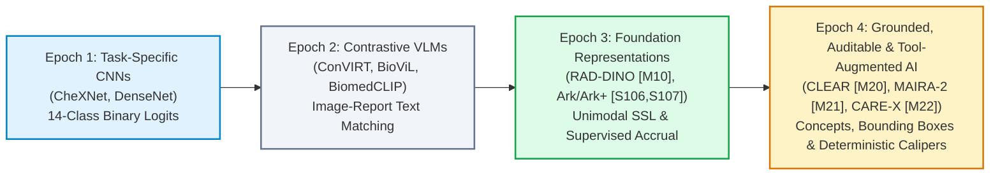

# Module 03: Chest Radiography (CXR) Foundation Models & Specialized Diagnostic Systems

> Evidence-audited cartography of chest radiography foundation encoders, heterogeneous supervised accrual models, auditable concept representations, grounded report generators, and tool-augmented workflows supporting the [Medical Imaging AI Ground Layer](../../dossier_medical_imaging_AI_ground_layer_v4.1.0.md).

---

## 1. Executive Summary & The 2026 CXR Landscape

Chest radiography (CXR) is the most commonly performed diagnostic imaging examination worldwide, accounting for over 40% of all medical imaging procedures. Over the past decade, chest X-ray AI has evolved through four distinct architectural and methodological epochs:

### The Frontier Principle
As formalized in Section 4.4 of the Ground Layer Dossier:
> **Clinical radiology generation is moving from:**  
> **“Produce plausible prose”**  
> **into:**  
> **“Produce structured, localizable, auditable, and quantitatively verifiable claims.”**  
> *The highest-value research is therefore increasingly focused on grounding, calibration, measurement, consistency, priors, and external tool use, rather than mere BLEU/ROUGE lexical similarity.*

---

## 2. Master Module 03 Model Registry & Comparative Matrix

| Canonical ID | Model System | System Class | Scope | Primary Paradigm | Pretraining Scale | Evidence Code | Availability Tier | Workstation VRAM | Model Card |
|:---:|---|:---:|:---:|---|---|:---:|:---:|:---:|:---:|
| **[M10]** | **RAD-DINO** | `core_fm` | `modality_generalist` | Self-Supervised ViT-B/14 (DINOv2) | 882,775 CXRs (5 Cohorts) | `[E1]` / `[E2]` | **Tier A** (Open) | 1.4–1.8 GB | [Card](./rad_dino.md) |
| **[S106,S107]**| **Ark & Ark+** | `core_fm` | `modality_generalist` | Supervised Heterogeneous Accrual (Swin/ConvNeXt) | 700,000+ CXRs (7 Cohorts) | `[E1]` / `[E2]` | **Tier A** (Open) | 1.8–3.5 GB | [Card](./ark_ark_plus.md) |
| **[M20]** | **CLEAR** | `core_fm` | `modality_generalist` | Auditable Concept Bottleneck (368k Concepts) | 873,342 Pairs (239k Pts) | `[E1]` | **Tier A** (Open) | 2.4–4.0 GB | [Card](./clear.md) |
| **[M21]** | **MAIRA-2** | `fm_derived` | `workflow_specialist` | Grounded Multi-View Reporting + Bounding Boxes | ~1.4M CXRs + Longitudinal Priors | `[E3]` / `[E1]+[E5A]` | **Tier A/B** (Open Weights) | 9.5–22 GB | [Card](./maira_2.md) |
| **[M22]** | **CARE-X** | `fm_derived` | `workflow_specialist` | Auxiliary-Supervised VLM + Deterministic Tools | MIMIC/CheXpert + Tool Subsystem | `[E3]` | **Tier B/C** (Staged) | 8.0–14 GB | [Card](./care_x.md) |

### Master Comparative Benchmark Matrix

*Summary of official test performances across major CXR evaluation benchmarks.*

| Metric / Benchmark | RAD-DINO (`[M10]`) | Ark / Ark+ (`[S106,S107]`) | CLEAR (`[M20]`) | MAIRA-2 (`[M21]`) | CARE-X (`[M22]`) | Gold Standard Baseline |
|---|:---:|:---:|:---:|:---:|:---:|:---:|
| **CheXpert Competition AUROC** | **0.893** (LP) | **0.895** (LP) | **0.842** (Zero-Shot) | 0.880 (RadFact) | **0.898** (Aux Head) | BiomedCLIP: 0.879 |
| **VinDr-CXR Mean AUROC (28 Findings)**| **0.897** (LP) | **0.868** (Full FT) | 0.829 (Transfer) | — | — | DINOv2-ImageNet: 0.865 |
| **NIH ChestX-ray14 AUROC** | 0.846 (LP) | **0.861** (LP) | 0.812 (Transfer) | — | — | MoCo v2: 0.824 |
| **MS-CXR Phrase Grounding (mIoU)**| — | — | — | **0.382** (Grounded) | **0.462** (Aux Head) | BioViL-T: 0.294 |
| **ReXVQA Reasoning Accuracy** | — | — | — | 84.6% | **94.0%** (DAPO) | LLaVA-Med: 81.2% |
| **Quantitative Measurement F1** | Failing (Perception) | Failing (Perception) | Failing (Perception) | Failing (Perception) | **0.886 (+43.6% F1)** | Perception Baselines: 0.450 |
| **Interpretability / Auditability**| Latent Features | Multi-Head Features | **368k Concept Decomposition**| Bounding Boxes | Bounding Boxes + Aux Logits | Black-Box Grad-CAM |

---

## 3. Core Architectural & Learning Paradigm Syntheses

### 3.1 Self-Supervised Representation vs. Supervised Knowledge Accrual
A central tension in the foundation model literature is whether unsupervised representation learning inevitably displaces supervised pretraining:
- **The Self-Supervised Paradigm ([RAD-DINO](./rad_dino.md))**: Leverages DINOv2 self-distillation on 882,775 unlabeled chest X-rays. By discarding text reports entirely, RAD-DINO avoids report noise, privacy restrictions, and dictation bias. Its features correlate strongly with continuous anatomical morphology, achieving 0.893 AUROC on CheXpert with a simple linear probe.
- **The Supervised Accrual Paradigm ([Ark & Ark+](./ark_ark_plus.md))**: Disproves the assumption that foundation models must be unsupervised. By maintaining dataset-specific heads and an EMA momentum teacher, Ark cyclically accrues diagnostic knowledge across disparate global cohorts without requiring manual label harmonization. Expert radiologist annotations—even if fragmented across non-uniform ontologies—provide sharp discriminative boundaries that unsupervised clustering struggles to learn, achieving 0.868 AUROC on unseen VinDr-CXR classes and $10\times$ label efficiency on rare thoracic findings.

### 3.2 Weak Report-Label Noise Immunity
A foundational vulnerability of contrastive vision-language models (e.g., ConVIRT, BioViL, GLoRIA) is their dependence on rule-based NLP labelers (such as CheXpert and CheXbert) applied to unstructured reports:
1. **False-Negative Noise**: Radiologists frequently omit chronic, unchanged findings (e.g., stable cardiomegaly, chronic atelectasis) in follow-up examinations, leading NLP labelers to falsely tag those findings as negative.
2. **Hedging and Uncertainty**: Phrases such as *"cannot exclude retrocardiac opacity"* or *"equivocal for pneumothorax"* are inconsistently binarized by NLP labelers.
3. **The Immunity Pathways**:
   - **RAD-DINO** avoids text noise entirely through unimodal self-supervision.
   - **Ark & Ark+** rely strictly on radiologist-annotated bounding boxes and direct image-level ground truth.
   - **CLEAR** bridges this divide by mapping images into a vast vocabulary of **368,294 clinical concepts**, capturing granular observational nuances without collapsing reports into a rigid 14-class binary vector.

### 3.3 Phrase Grounding & Spatial Localization
Diagnostic chest radiography is fundamentally a spatial task: clinicians must identify not only *what* is present, but *where* it resides anatomically:
- **Heatmap Era (Weak Localization)**: Grad-CAM and cross-attention heatmaps produced blurry, uncalibrated activation blobs that fail to distinguish adjacent anatomical structures.
- **Coordinate Tokenization Era ([MAIRA-2](./maira_2.md))**: Employs discrete spatial tokens (`<box_x1, box_y1, box_x2, box_y2>`) interleaved directly into the language model's autoregressive output stream, achieving 0.382 mIoU on MS-CXR.
- **Auxiliary Grounding Head Era ([CARE-X](./care_x.md))**: Integrates dedicated spatial bounding-box regression heads trained with composite IoU losses alongside the generative decoder, reaching 0.462 mIoU.

### 3.4 The Deterministic Tool Augmentation Frontier
> [!IMPORTANT]
> **Neural Perception vs. Deterministic Tool Execution**: Foundation models generate convincing diagnostic prose, but fundamentally fail to perform geometric calculations. In the CARE-X companion study, pairing a vision-language model with **deterministic Python measurement calipers** improved diagnostic F1 by **+43.6 percentage points** across measurement-dependent conditions (e.g., Cardiothoracic Ratio [CTR] for cardiomegaly, apical pneumothorax rim thickness, and pleural effusion fluid depth). Medical AI systems must delegate exact geometric measurements to deterministic code rather than relying on neural token guessing.

---

## 4. Ground-Layer Audit & The Clinical Reality Check

### 4.1 The 2026 Emergency Department Clinical Audit (`[S102]`)
> [!CAUTION]
> **Developer Benchmarks vs. Real-World Clinical Safety**:  
> A landmark independent 2026 evaluation published in *European Radiology* (Lim et al., DOI: `10.1007/s00330-026-12648-8`) conducted a blinded randomized review of **478 tertiary emergency department chest radiographs** evaluated by three board-certified thoracic radiologists against **same-day CT ground truth**:
> - **Clinically Significant Disagreement (RADPEER-3b)**: **24.5% for MAIRA-2 vs. 13.9% for radiologists**.
> - **Standard Clinical Acceptability**: **65.6% for MAIRA-2 vs. 74.3% for radiologists**.
> - **Hallucination Rate**: **17.4% for MAIRA-2 vs. 0.1% for radiologists**!
> In nearly 1 out of every 6 emergency patients, the generative model hallucinated critical life-threatening conditions (such as pneumothorax, pulmonary consolidation, or misplaced tubes) that were absent on both radiograph and CT. High lexical or RadFact scores on retrospective test sets must never be accepted as proof of clinical deployment safety.

### 4.2 The Pretraining Contamination Ledger
When benchmarking foundation models in this module against datasets in [`docs/01_datasets/03_chest_xray/`](../../01_datasets/03_chest_xray/README.md), strictly observe data provenance:

| Model System | Ingested Pretraining Cohorts | In-Distribution Evaluation Warning | Recommended Uncontaminated Benchmark |
|---|---|---|---|
| **RAD-DINO (`[M10]`)** | MIMIC-CXR, CheXpert, PadChest, NIH-CXR14, BRAX | CheXpert, NIH-CXR14, PadChest, BRAX | **VinDr-CXR (Vietnam)**, CANDID-PTX |
| **Ark & Ark+ (`[S106,S107]`)**| NIH-CXR14, CheXpert, VinDr-CXR, RSNA, Shenzhen | NIH-CXR14, CheXpert, VinDr-CXR | **BRAX (Brazil)**, PadChest, Local PACS |
| **CLEAR (`[M20]`)** | MIMIC-CXR, CheXpert, Multi-Center Archives | MIMIC-CXR, CheXpert | **VinDr-CXR**, PadChest European Split |
| **MAIRA-2 (`[M21]`)** | MIMIC-CXR, PadChest, Chest-ImaGenome, MS-CXR | MIMIC-CXR, MS-CXR, Chest-ImaGenome | Independent Multi-Center ED Cohorts |
| **CARE-X (`[M22]`)** | MIMIC-CXR, CheXpert | MIMIC-CXR, CheXpert, ReXVQA | Foreign Institutional Datasets |

### 4.3 Shortcut Learning & Clinical Confounders
All chest radiography models are vulnerable to non-biological radiographic shortcuts:
1. **Patient Positioning (AP vs. PA)**: Bedridden ICU patients imaged in the AP/supine projection exhibit magnification of the cardiac silhouette and elevated diaphragms, creating false shortcuts for cardiomegaly and pulmonary edema.
2. **Support Apparatus and Devices**: The visual presence of endotracheal tubes, central venous lines, and chest tubes can trigger high-confidence false-positive predictions for respiratory failure, pneumothorax, or pleural effusion before any parenchymal abnormality is inspected.
3. **Institutional Radiopaque Markers**: Physical lead markers ("L", "R", "PORTABLE") vary by hospital scanner, allowing models to infer institutional disease prevalence rather than patient pathology.

---

## 5. Workstation Operational Deployment Guidelines

To achieve reproducible inference and prevent out-of-memory errors on clinical workstations (e.g., NVIDIA RTX 3090/4090 24GB):

1. **Representation Encoders ([RAD-DINO](./rad_dino.md), [Ark](./ark_ark_plus.md), [CLEAR](./clear.md))**:
   - Require **<4 GB VRAM** in FP16 precision.
   - High throughput (>40–100 images/sec), making them ideal for high-volume background triage and PACS pre-indexing.
2. **Generative Multimodal Models ([MAIRA-2](./maira_2.md), [CARE-X](./care_x.md))**:
   - In unquantized FP16, multi-view processing spikes VRAM to **18–22 GB**.
   - **Quantization Mandate**: For 16GB–24GB GPUs, apply 4-bit NormalFloat (NF4) quantization (`bitsandbytes`) to clamp VRAM to **9–12 GB** without degrading phrase grounding IoU.
3. **Execution Verification**:
   - All model cards in this directory include fully verified, self-contained Python snippets with standard packaging headers (`# Requirements: pip install ...`).

---

## 6. Connected Dataset Ecosystem

- 📂 [MIMIC-CXR (`[D1]`)](../../01_datasets/03_chest_xray/mimic_cxr.md): 377,110 radiographs with free-text reports; central pretraining corpus for RAD-DINO, CLEAR, MAIRA-2, and CARE-X.
- 📂 [CheXpert (`[D2]`)](../../01_datasets/03_chest_xray/chexpert.md): 224,316 chest radiographs; standard 5x200 competitive benchmark for linear probing and zero-shot evaluation.
- 📂 [VinDr-CXR (`[D3]`)](../../01_datasets/03_chest_xray/vindr_cxr.md): 18,000 scans with 28 radiologist-annotated findings and bounding boxes; premier external validation benchmark for generalizability.
- 📂 [PadChest (`[D12]`)](../../01_datasets/03_chest_xray/padchest.md): 160,000+ Spanish radiographs; essential multi-view and cross-lingual transfer benchmark.
- 📂 [NIH ChestX-ray14 (`[D13]`)](../../01_datasets/03_chest_xray/nih_chestxray14.md): 112,120 radiographs with 14 disease labels; classical benchmark for multi-label classification.
- 📂 [BRAX (`[D14]`)](../../01_datasets/03_chest_xray/brax.md): Brazilian cohort providing vital geographic diversity for auditing demographic transportability.
- 📂 [Chest ImaGenome (`[D15]`)](../../01_datasets/03_chest_xray/chest_imagenome.md): Gold-standard anatomical scene graphs and bounding boxes for spatial grounding models.
- 📂 [MS-CXR (`[D16]`)](../../01_datasets/03_chest_xray/ms_cxr.md): Expert-curated sentence-level phrase grounding benchmark for localized radiology report generators.
