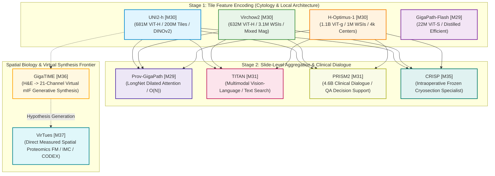

# Module 04: Computational Pathology, Whole-Slide Imaging & Spatial Biology Models

> Evidence-audited cartography of digital pathology foundation models, whole-slide aggregators, clinical dialogue agents, and spatial biology systems supporting the [Medical Imaging AI Ground Layer](../../dossier_medical_imaging_AI_ground_layer_v4.1.0.md).

---

## 1. Executive Summary & The Core Landscape Tension

In computational pathology and spatial biology, whole-slide imaging (WSI) represents an extreme computational challenge in medical AI: an individual surgical biopsy or resection scan measures upwards of $100{,}000 \times 100{,}000$ pixels (several gigapixels uncompressed), containing tens of thousands of individual cells and gland architectures. Direct end-to-end backpropagation across gigapixel slides is computationally intractable, creating a foundational divide across representation paradigms:

1. **The Two-Stage Representation Hierarchy**: The field decouples learning into **Stage 1: Tile Encoders** ([Virchow2](./virchow2.md), [UNI2-h](./uni2_h.md), [H-Optimus-1](./h_optimus_1.md)) that extract local cytologic features at $20\times/40\times$, and **Stage 2: Slide-Level Aggregators** ([Prov-GigaPath](./prov_gigapath.md), [TITAN](./titan.md), [PRISM2](./prism2.md)) that model long-range spatial context, multi-instance dependencies, and natural-language report alignment.
2. **Generalist Vision vs. Workflow-Specialized Clinical Systems**: While massive generalist models compete on retrospective offline benchmarks, specialized models ([CRISP](./crisp.md)) bridge non-standard physical domains—such as intraoperative frozen cryosections—delivering sub-minute surgical margin triage in prospective clinical trials.
3. **Virtual Staining vs. Measured Spatial Proteomics**: The spatial biology frontier separates cross-modal generative synthesis ([GigaTIME](./gigatime.md), inferring virtual mIF from H&E morphology) from direct foundation modeling of physical multiplex measurements ([VirTues](./virtues.md)).



---

## 2. Master Module 04 Model Registry & Comparative Matrix

| Canonical ID | Model System | System Class | Scope | Pretraining Scale & Data | Evidence Code | Availability Tier | Inference VRAM | Model Card |
|:---:|---|:---:|:---:|---|:---:|:---:|:---:|:---:|
| **`[M29]`** | **Prov-GigaPath & Flash** | `core_fm` | `specialty_generalist` | 171,189 WSIs (1.38B tiles); LongNet | `[E1]` (*Nature* 2024) / `[E3]` | **Tier B** (Gated) | 14–18 GB | [Card](./prov_gigapath.md) |
| **`[M30]`** | **Virchow2 & Virchow2G** | `core_fm` | `specialty_generalist` | 3.1M WSIs (>1.5B tiles); Mixed Mag | `[E3]` (arXiv) / `[E1]` (*Nat Med*) | **Tier B** (Gated) | 12–16 GB | [Card](./virchow2.md) |
| **`[M30]`** | **UNI & UNI2-h** | `core_fm` | `specialty_generalist` | >350k WSIs (>200M tiles); ViT-H 681M | `[E1]` (*Nat Med* 2024) / `[E2]` | **Tier B** (Gated) | 14–16 GB | [Card](./uni2_h.md) |
| **`[M30]`** | **H-Optimus-0 / 1** | `core_fm` | `specialty_generalist` | >1M WSIs (>800k pts, 4k centers); 1.1B | `[E3]` (AACR 2026) / `[E2]` | **Tier B** (Gated) | 16–20 GB | [Card](./h_optimus_1.md) |
| **`[M31]`** | **TITAN** | `core_fm` | `specialty_generalist` | 335,645 WSIs; 600k reports/captions | `[E1]` (*Nature Medicine* 2025) | **Tier B** (Gated) | 12–16 GB | [Card](./titan.md) |
| **`[M31]`** | **PRISM2** | `core_fm` | `specialty_generalist` | 2.3M WSIs; 14M QA pairs; 4.6B param | `[E1]` (*Nature Medicine* 2026) | **Tier B/C** (Gated) | 18–24 GB | [Card](./prism2.md) |
| **`[M35]`** | **CRISP** | `core_fm` | `workflow_specialist` | >100k intraoperative frozen slides | `[E1]` (*Nature Medicine* 2026) | **Tier B** (Open) | 8–12 GB | [Card](./crisp.md) |
| **`[M37]`** | **VirTues** | `core_fm` | `specialty_generalist` | Multiplex spatial proteomics (IMC/CODEX) | `[E1]` (*Nature* 2026) | **Tier A** (Open) | 8–14 GB | [Card](./virtues.md) |
| **`[M36]`** | **GigaTIME & Flash** | `fm_derived` | `workflow_specialist` | 14,256 patients; 40M cells; 21 channels | `[E1]` (*Cell* 2026) / `[E3]` | **Tier B** (Gated) | 8–16 GB | [Card](./gigatime.md) |

---

## 3. The Two-Stage Patch-to-Slide Hierarchy & Gigapixel Scaling

Whole-slide histopathology images present an extreme spatial scale problem: a single slide digitized at $20\times$ or $40\times$ contains up to $10^{10}$ pixels. To manage this volume without exceeding GPU memory boundaries, the field operates along a strict multi-scale spatial hierarchy:

```
[Sub-cellular Organelle] (Chromatin texture, nucleoli, mitotic spindles)
       │
       ▼
[Single Cell / Nucleus] (Segmented boundaries: StarDist, Mesmer, HoVer-Net)
       │
       ▼
[Patch / Tile Layer] (256x256 to 512x512 px @ 20x/40x: Virchow2, UNI2-h, Prov-GigaPath, H-Optimus-1)
       │
       ▼
[Adaptive Morphological Region / ROI] (Tissue clusters, tertiary lymphoid structures: CARE [S90])
       │
       ▼
[Whole-Slide Image (WSI)] (10,000 - 50,000 tiles pooled via AB-MIL, TransMIL, LongNet, nnMIL)
       │
       ▼
[Patient Examination / Case] (Aggregation across multiple slides, e.g., CAMELYON17 5 slides/pt)
       │
       ▼
[Clinical Cohort] (Multi-center epidemiological or trial cohort: TCGA, CPTAC)
```

### Mathematical & Computational Principles
1. **The Counting-Unit Discipline**:
   $$\text{Patient} \neq \text{Examination} \neq \text{Slide (WSI)} \neq \text{Tile / Patch} \neq \text{Segmented Nucleus}$$
   Reporting "a dataset of 500,000 images" when referring to 500,000 tiles extracted from 50 patients conflates independent statistical observations with spatial subsamples.
2. **Sub-Quadratic Slide Context Scaling**:
   - Standard Multi-Head Self-Attention: Computational and memory complexity scales as $O(N^2)$, exhausting GPU memory when $N > 4{,}000$ tiles.
   - Attention-MIL / CLAM: Permutation-invariant bag-of-words pooling achieves $O(N)$ speed but completely discards spatial topology.
   - LongNet Dilated Attention ([Prov-GigaPath](./prov_gigapath.md)): Utilizes exponentially expanding segment lengths ($w = [1024, 2048, 4096, \dots]$) with dilated strides, achieving true $O(N)$ linear complexity over $>50{,}000$ patch tokens while preserving cross-slide spatial relationships.

---

## 4. The TCGA Contamination Doctrine

A non-negotiable scientific rule established in the Ground-Layer Master Dossier (`Section 3A.6` and `Section 17.3`):

> **The Cancer Genome Atlas (TCGA `[D25]`) must be treated as IN-DISTRIBUTION / CONTAMINATED by default for modern foundation models.**

### Why TCGA Cannot Prove Generalization
1. **Pervasive Pretraining Inclusion**: Because TCGA diagnostic and frozen whole-slide images have been openly available through the NCI Genomic Data Commons for over a decade, almost every modern pathology foundation model (Prov-GigaPath, Virchow, Virchow2, UNI, UNI2-h, H-Optimus-1, TITAN) ingested TCGA into its pretraining mixture.
2. **The In-Domain Illusion**: High zero-shot or linear-probing AUROC on TCGA cohorts (e.g., predicting *TP53* mutation in TCGA-BRCA or subtyping TCGA-NSCLC) measures **training memorization and representation alignment**, not true out-of-distribution (OOD) generalizability.
3. **Rigorous Evidence Standard**: True external generalization requires testing on independent clinical cohorts verifiably withheld from pretraining manifests:
   - **CPTAC (`[D26]`)**: Multi-center proteogenomic cohorts.
   - **CAMELYON17 Blind Test (`[D27]`)**: Held-out lymph node sections from 5 Dutch centers.
   - **PANDA Hidden Test (`[D28]`)**: Multi-scanner prostate core biopsies.
   - **PathoROB Multi-Center Suite (`[S29]`)**: 8 international multi-center patch benchmarks.

---

## 5. The PathoROB Robustness Findings: Technical Confounds vs. Biology

In June 2026, the landmark study *“Towards robust foundation models for digital pathology”* (*Nature Communications* 17, 5218 `[S29]`) introduced the **PathoROB benchmark**, demonstrating a critical vulnerability in digital pathology foundation models:

> **Pathology FM embeddings strongly encode non-biological technical features (medical centre, slide scanner optics, and staining reagent batches).**

### Key Empirical Findings
- **High Center Predictability**: In frozen-feature linear probing, the originating medical center and slide scanner could be predicted from patch embeddings with up to **$95\%$ accuracy**.
- **Spurious Correlation Risk**: A model exhibiting high in-domain task AUROC may simply be exploiting scanner-specific or laboratory-specific artifacts rather than learning true cellular morphology.
- **The Robustness Index ($R_{\text{idx}}$)**: PathoROB separates biological utility ($\text{AUROC}_{\text{bio}}$) from technical confound sensitivity ($\text{AUROC}_{\text{conf}}$):
  $$R_{\text{idx}} = \text{AUROC}_{\text{bio}} \times (1 - \text{AUROC}_{\text{conf}})$$
  In comparative audits, **UNI2-h** achieved the highest verified Robustness Index (**0.842**), followed by **Virchow2** (**0.826**) and **Prov-GigaPath** (**0.812**).

---

## 6. Ground-Layer Model Selection Insights

Selecting a computational pathology foundation model is **a multi-objective engineering trade-off**, not a simple parameter-count contest:

1. **The Leading Cluster Reality**: In the 32-model *Nature Communications* benchmark (Bareja et al., 2026 `[S28]`), **Virchow2**, **Prov-GigaPath**, and **UNI2-h** formed a tightly clustered leading tier with overlapping confidence intervals. No single model universally wins across all organs and tasks.
2. **Efficiency and Distillation**: Distilled student models—such as the 22M parameter **GigaPath-Flash** (`[S33]`) or **Virchow2G Mini**—retain $\approx 97\%$ of the slide-level diagnostic AUROC while slashing inference latency by $50\times$, making them ideal for high-throughput laboratory PACS integration.
3. **Workflow Specialization vs. Generality**: In specialized surgical environments (e.g., intraoperative frozen-section margin consultation), **CRISP** (`[M35]`) decisively outperforms generalist FFPE foundation models due to cryo-artifact invariance.
4. **Virtual vs. Measured Spatial Biology**:
   - **GigaTIME (`[M36]`)**: Synthesizes virtual immunofluorescence from H&E morphology; useful for high-throughput hypothesis generation, but **must never be treated as physical truth**.
   - **VirTues (`[M37]`)**: Directly models measured multi-channel spatial proteomics (IMC, MIBI, CODEX) across heterogeneous antibody panels.

---

## 7. Connected Ecosystem Navigation

### Model Dossiers (`docs/02_models/04_pathology_wsi/`)
- 📄 [`prov_gigapath.md`](./prov_gigapath.md): Prov-GigaPath & GigaPath-Flash (LongNet Dilated Attention)
- 📄 [`virchow2.md`](./virchow2.md): Virchow2 & Virchow2G (Mixed-Magnification ViT-H / ViT-G)
- 📄 [`uni2_h.md`](./uni2_h.md): UNI & UNI2-h (Harvard / MGB Generalist Foundation Model)
- 📄 [`h_optimus_1.md`](./h_optimus_1.md): H-Optimus-0 & H-Optimus-1 (1.1B Open-Weight Vision FM)
- 📄 [`titan.md`](./titan.md): TITAN (Multimodal Whole-Slide Vision-Language FM)
- 📄 [`prism2.md`](./prism2.md): PRISM2 (4.6B Clinical Dialogue & Decision Support)
- 📄 [`crisp.md`](./crisp.md): CRISP (Real-Time Intraoperative Frozen-Section Specialist)
- 📄 [`virtues.md`](./virtues.md): VirTues (Multi-Scale Measured Spatial Proteomics FM)
- 📄 [`gigatime.md`](./gigatime.md): GigaTIME & Flash (Cross-Modal Virtual mIF Generative Synthesis)

### Connected Dataset Library (`docs/01_datasets/04_pathology_spatial/`)
- 📂 [TCGA (`[D25]`)](../../01_datasets/04_pathology_spatial/tcga.md): Pan-cancer reference cohort (In-distribution baseline audit)
- 📂 [CPTAC (`[D26]`)](../../01_datasets/04_pathology_spatial/cptac.md): Multi-center proteogenomic external validation cohort
- 📂 [CAMELYON17 (`[D27]`)](../../01_datasets/04_pathology_spatial/camelyon17.md): Breast sentinel lymph node metastasis challenge
- 📂 [PANDA (`[D28]`)](../../01_datasets/04_pathology_spatial/panda.md): Prostate core biopsy ISUP grading benchmark
- 📂 [GigaTIME Benchmark (`[D29]`)](../../01_datasets/04_pathology_spatial/gigatime_benchmark.md): Paired H&E to 21-channel physical mIF benchmark
- 📂 [PathoROB Suite (`[S29]`)](../../01_datasets/04_pathology_spatial/pathorob_suite.md): Multi-center patch robustness and confound benchmark
