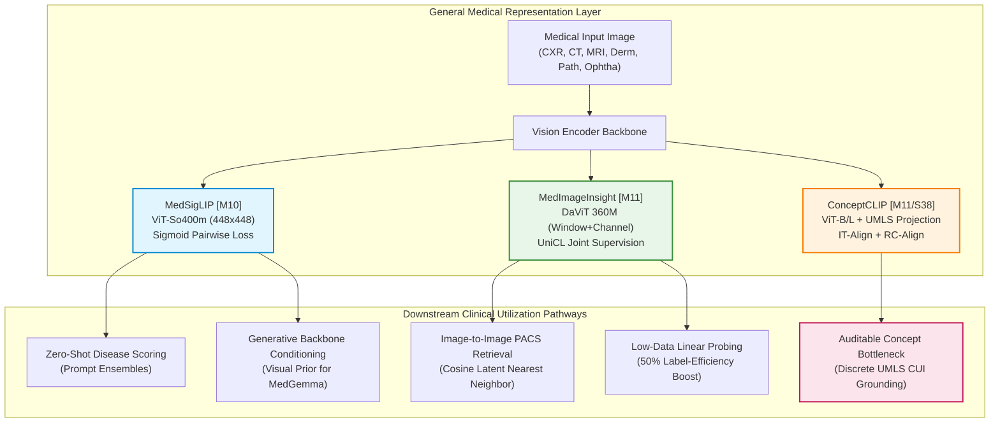
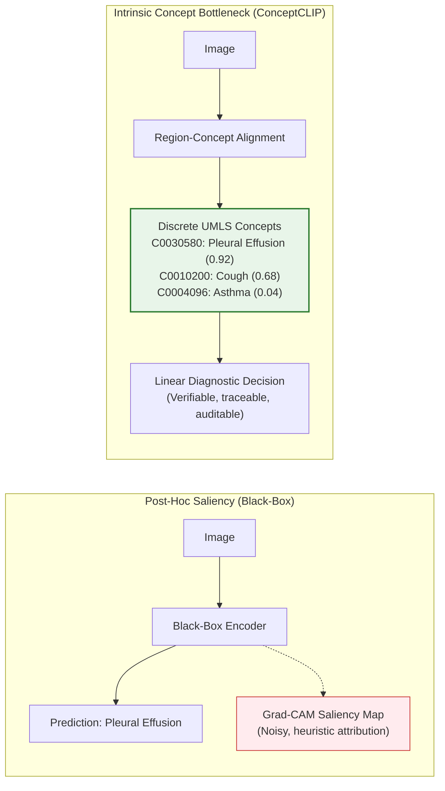

# Module 06: General Medical Representation Foundation Models & Embedding Geometry

> Evidence-audited cartography of general-domain medical vision-language representation encoders, contrastive embedding spaces, and concept-grounded foundation models supporting the [Medical Imaging AI Ground Layer](../../dossier_medical_imaging_AI_ground_layer_v4.1.0.md).

---

## 1. Executive Summary & The Core Landscape Tension

In medical AI, there is a common systemic misconception that developers should immediately transition from classical supervised convolutional networks to massive generative Vision-Language Models (VLMs) like Med-PaLM M or MedGemma. As codified in Section 4.1 of the Ground Layer Dossier:
> **The representation layer is a foundational pillar of medical imaging AI.**  
> *Self-supervised and contrastive image–text encoders are often vastly more computationally efficient, reproducible, calibration-stable, and clinically auditable than generative decoders for disease classification, cross-modal image-to-image retrieval, active learning, dataset curation, and low-label adaptation.*

### The Representation Triad
Module 06 maps the three preeminent generalist representation paradigms:
1. **The Sigmoid Contrastive Pioneer ([MedSigLIP `[M10]`](./medsiglip.md))**: Google Health's dual-tower ~840M parameter encoder employing SigLIP loss to break batch-size dependencies across five medical imaging domains.
2. **The Dual-Attention Enterprise Generalist ([MedImageInsight `[M11]`](./medimageinsight.md))**: Microsoft Research's DaViT-based foundation model spanning 10 clinical imaging domains, deploying Unified Contrastive Learning (UniCL) via Azure AI Foundry cloud endpoints.
3. **The Explainable Concept-Aligned Frontier ([ConceptCLIP `[M11/S38]`](./conceptclip.md))**: HKUST's *Nature Biomedical Engineering* (2026) foundation model pairing global caption alignment with fine-grained region-to-UMLS concept grounding across 23 million multimodal triplets.

---

## 2. Master Module 06 Model Registry & Comparative Matrix

| Canonical ID | Model System | System Class | Scope | Modality Coverage | Pretraining Corpus Scale | Evidence Code | Availability Tier | Workstation VRAM | Model Card |
|:---:|---|:---:|:---:|---|---|:---:|:---:|:---:|:---:|
| **[M10]** | **MedSigLIP** | `core_fm` | `generalist` | CXR, Derm, Ophtha, Path, CT/MRI (2D) | 100M+ paired clinical image-reports | `[E2]` | **Tier B** (Gated HF) | 4–6 GB | [Card](./medsiglip.md) |
| **[M11]** | **MedImageInsight** | `core_fm` | `generalist` | 10 Modalities (X-Ray, CT, MRI, US, Path, etc.) | Large-scale pan-modal clinical corpora | `[E2]` | **Tier D** (Cloud API) | 8–10 GB (Port) / Cloud | [Card](./medimageinsight.md) |
| **[M11/S38]** | **ConceptCLIP** | `core_fm` | `generalist` | 10 Modalities (Pan-biomedical) | 23M triplets (MedConcept-23M) | `[E1]` | **Tier B** (Gated HF) | 4–8 GB | [Card](./conceptclip.md) |

---

## 3. Generalist Embedding Geometry & Multi-Modal Alignment Dynamics

The mathematical foundation of medical representation models dictates their transfer capability, training stability, and error geometry:

### 3.1 Softmax InfoNCE vs. Sigmoid Pairwise Loss (SigLIP)
Standard CLIP architectures employ categorical cross-entropy with a softmax denominator summed across all batch instances:
$$\mathcal{L}_{\text{InfoNCE}} = -\frac{1}{B} \sum_{i=1}^B \log \frac{\exp(\mathbf{v}_i^\top \mathbf{u}_i / \tau)}{\sum_{j=1}^B \exp(\mathbf{v}_i^\top \mathbf{u}_j / \tau)}$$
- **The Mini-Batch Coupling Dilemma**: In medical imaging, diverse manifestations of the same broad pathology (e.g., subtle bibasilar atelectasis) often co-occur in the same batch. InfoNCE penalizes valid partial clinical matches because non-paired samples are treated as strictly negative.
- **The SigLIP Solution ([MedSigLIP](./medsiglip.md))**: By casting alignment into independent pairwise binary sigmoid classifications with learned temperature $t$ and bias $b$, MedSigLIP decouples batch size from loss normalization, allowing stable multi-modal pretraining without requiring massive batch sizes ($>32\text{k}$).

### 3.2 Dual-Attention Multi-Scale Encoding (DaViT & UniCL)
Medical images exhibit a severe spatial-scale dichotomy: a fracture or microcalcification occupies $<0.1\%$ of the field-of-view, whereas cardiomegaly or hepatomegaly spans the entire scan:
- **Local Window Attention**: Constrains self-attention to fine sub-regions to preserve high-frequency structural edges.
- **Global Channel Attention**: Dynamically recalibrates feature channels across the full anatomical field to encode global spatial context.
- **Unified Contrastive Learning (UniCL, [MedImageInsight](./medimageinsight.md))**: Combines text-image contrastive loss with supervised categorical labels, forcing the latent geometry to preserve diagnostic cluster separation.

### 3.3 The Medical Modality Gap
In multimodal latent representations, an unaddressed **modality gap** emerges: images cluster tightly by physical modality (all CT scans grouped together; all dermatoscopic images grouped together) rather than by underlying disease pathophysiology. Concept-enhanced pretraining ([ConceptCLIP](./conceptclip.md)) mitigates this modality clustering by projecting cross-modal visual tokens into shared semantic UMLS concept anchors.

---

## 4. Linear Probing vs. Zero-Shot Transfer Dynamics

A critical empirical rule codified across medical representation literature:
> [!IMPORTANT]
> **The +4% to +8% Linear Probing Advantage**: Across nearly all benchmark tasks (CheXpert, RSNA Pneumonia, ISIC 2019), **frozen linear probing consistently outperforms zero-shot text-prompt matching by +4.0% to +8.5% AUC**.

### The Medical Prompt Brittleness Problem
Zero-shot transfer relies on textual prompt synthesis (e.g., `"A chest radiograph demonstrating severe cardiomegaly"`). This introduces three systemic vulnerabilities:
1. **Lexical Synonymy**: Subtle terminology changes (`"cardiomegaly"` vs. `"enlarged cardiac silhouette"` vs. `"increased cardiothoracic ratio"`) yield radically different cosine similarity scores.
2. **Clinical Severity Grading**: Text prompts struggle to distinguish borderline normal findings from early pathology without exhaustive multi-sentence prompt ensembling.
3. **Negation Ambiguity**: Standard vision-language encoders frequently mistake the text phrase `"no evidence of pneumothorax"` for a positive indication of pneumothorax due to bag-of-words token proximity effects.

### The Fine-Tuning vs. Feature Freezing Trade-Off
When deploying representation models to specific clinical tasks:
- **Frozen Linear Probing**: Highly recommended for small datasets ($N < 1,000$). Preserves general multi-modal geometry, prevents overfitting, and eliminates catastrophic forgetting.
- **Full Parameter Fine-Tuning**: Destroys the general-domain multi-modality of the foundation model. Fine-tuning MedSigLIP or ConceptCLIP exclusively on chest radiographs collapses its ophthalmology and dermatology feature discriminability within 3 epochs.

---

## 5. Concept Bottleneck Interpretability vs. Causal Reasoning

### Intrinsic Concept Bottlenecks vs. Post-Hoc Saliency
Traditional post-hoc explainability methods (such as Grad-CAM or integrated gradients) frequently suffer from visual artifacting, high sensitivity to input perturbations, and lack of anatomical specificity. 
In contrast, **Concept Bottleneck Architectures ([ConceptCLIP](./conceptclip.md))** force image embeddings through a predefined, discrete medical ontology (UMLS Metathesaurus):
$$\mathbf{z}_{\text{image}} \xrightarrow{\text{RC-Align}} \mathbf{c} \in \mathbb{R}^{K} \quad \text{where } c_k \text{ represents confidence for UMLS Concept } k$$

### The Causal Reasoning Fallacy
> [!CAUTION]
> **Correlation Is Not Medical Causation**: Concept-aligned models demonstrate where an image activates a standardized medical concept. However:
> - The model captures **statistical co-occurrence** in training literature/reports, NOT pathophysiological mechanisms.
> - Confounders such as chest drain tubes, surgical staples, monitoring leads, and radiopaque hospital markers frequently trigger false-positive concept activations.
> - Concept activations must serve as an audit tool for human clinicians, never as autonomous causal diagnoses.

---

## 6. Ground-Layer Audit: Contamination & Evaluation Hygiene

### Pretraining Contamination Ledger
When auditing representation models in this module against datasets in [`docs/01_datasets/`](../../01_datasets/README.md):
- **Universal Pretraining Contamination**: MedSigLIP, MedImageInsight, and ConceptCLIP ingested the vast majority of open-access medical imaging benchmarks (MIMIC-CXR, CheXpert, PadChest, NIH ChestX-ray14, TCGA, ISIC) during pretraining.
- **In-Distribution Status**: Benchmark claims on these public datasets must be classified as **in-distribution or near-distribution evaluations**.
- **The Clean Out-of-Distribution Mandate**: To measure true generalist transfer, models must be evaluated against strictly withheld cohorts (e.g., [RAD-ChestCT](../../01_datasets/02_radiology_ct_mri/rad_chestct.md) or private multi-center hospital archives).

---

## 7. Workstation Operational Deployment Guidelines

1. **Precision**: Always run inference in `torch.bfloat16` or `torch.float16`. FP16 reduces memory consumption by 50% without metric loss.
2. **Text Token Limits**: Respect architectural maximum sequence lengths (MedSigLIP: 64 tokens; ConceptCLIP: 77 tokens). Segment lengthy reports into diagnostic sentence chunks before embedding.
3. **Cloud Endpoint Latency (MedImageInsight Tier D)**: Buffer network latency (~150–300 ms RTT) when architecting real-time clinical screening pipelines.
4. **Authentic Snippets**: All individual model cards provide fully functional Python verification snippets with dependency installation headers.
